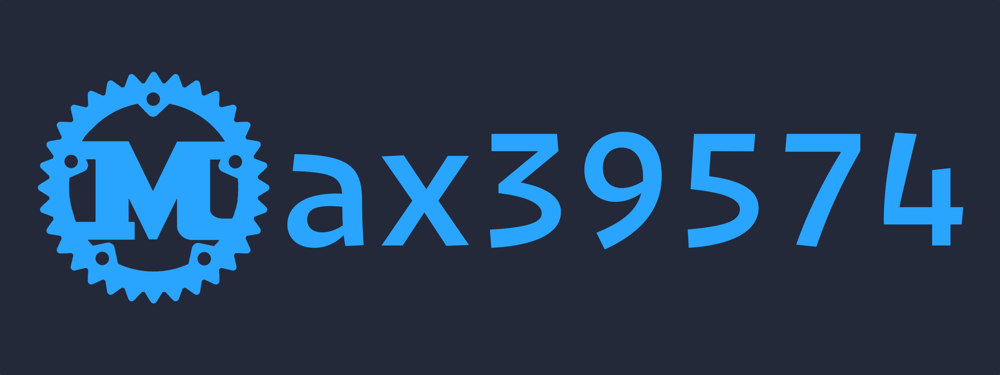

I am a Student from Switzerland.

  

- 🔭 I'm currently working on developing neovim plugins.

- 🌱 I'm currently learning Rust.

- 🤝 Feel free to give me any tips for my neovim configuration or any of my projects.

### 🛠️ Languages and Tools:

&nbsp;
&nbsp;
&nbsp;
&nbsp;
&nbsp;

[]
<!--  -->

